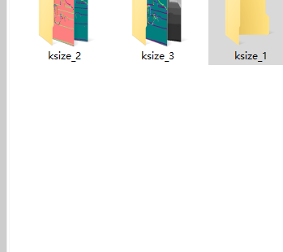

# 记录

目录

-1.
[link](#test)
##
## network
test

[//]:


<a id="link1"></a>
## 法向

normalspeed来自FFB6D
#### normspeed 参数
```
k_size = 1                      # 单位:pixel  卷积核的大小
distance_threshold = 20000      # 单位:mm     深度值超过这个点云不再参与计算
difference_threshold = 10       # 单位:mm     卷积核中与中心点深度差超过该值则不参与计算
point_into_surface = False
```

下面是Real数据集中的测试数据
<div class="img_group" style="text-align:center;">
<div class="sub_img" style="width:30%;display: inline-block;">

<p  style="margin-top: 0">depth_view</p>
</div>
<div class="sub_img" style="width:30%;display: inline-block;">

<p style="margin-top: 0">normal_map_in</p>
</div>
<div class="sub_img" style="width:30%;display: inline-block;">

<p  style="margin-top: 0">normal_map_out</p>
</div>
</div>
下面是Real数据集中的测试数据
<div class="img_group" style="text-align:center;">
<div class="sub_img" style="width:30%;display: inline-block;">

<p  style="margin-top: 0">depth_view</p>
</div>
<div class="sub_img" style="width:30%;display: inline-block;">

<p style="margin-top: 0">normal_map_in</p>
</div>
<div class="sub_img" style="width:30%;display: inline-block;">

<p  style="margin-top: 0">normal_map_out</p>
</div>
</div>
下面是Real数据集中的测试数据
<div class="img_group" style="text-align:center;">
<div class="sub_img" style="width:30%;display: inline-block;">

<p  style="margin-top: 0">depth_view</p>
</div>
<div class="sub_img" style="width:30%;display: inline-block;">

<p style="margin-top: 0">normal_map_in</p>
</div>
<div class="sub_img" style="width:30%;display: inline-block;">

<p  style="margin-top: 0">normal_map_out</p>
</div>
</div>
下面是Real数据集中的测试数据
<div id="test" style="text-align:center;">
<div class="sub_img" style="width:30%;display: inline-block;">

<p  style="margin-top: 0">depth_view</p>
</div>
<div class="sub_img" style="width:30%;display: inline-block;">

<p style="margin-top: 0">normal_map_in</p>
</div>
<div class="sub_img" style="width:30%;display: inline-block;">

<p  style="margin-top: 0">normal_map_out</p>
</div>
</div>


