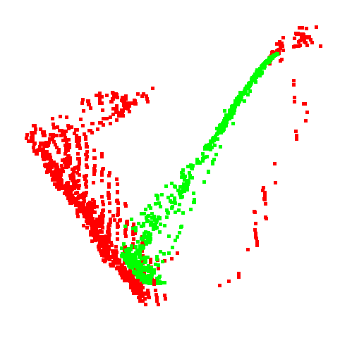
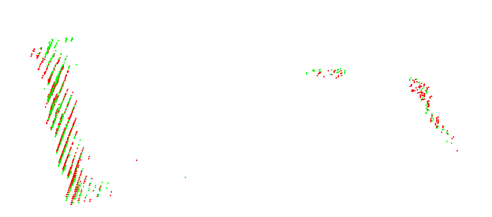
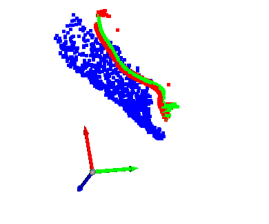

# 记录

目录

> -1.
> [link](#test)
> 
> -[to do list](#link_todolist)
##
## network
test

test


## to do list<a id="link_todolist"></a>
### 对照实验
+ 用第t帧作为coord得到的点云，t+1帧作为观测点云pts vs 反过来
  
  理论上用第t帧代替coord的角色会更好，因为初始mask的原因，t帧的点云更干净

### code
1. 主体
> + 训练 <a style="color:red">已完成</a>
>
> + 评估 ：将test数据集输入模型（但是不计算梯度）得到预测结果A1A2（1 OK）后，转换成两帧间的位姿RT（2 OK ）与gt进行比较。得到误差，这里需要误差评估函数（3 working ）
>
> + 给训练添加进度条 working

2. A1A2互逆损失函数 

> <a style="color:red">已完成</a>

3. 可视化工具 

> + open3d可视化代码如何对应到每一个点，例如有深度图和normal map，想将normal map的颜色在点云中可视化出来

### 可视化时的坐标系使用自己绘制的

图中细的黑线是自己用(0,0,0),(0,0,1),(0,1,0),(1,0,0)绘制的xyz坐标


使用下面的代码(右, )来创建坐标系

> coordinateMesh = o3d.geometry.TriangleMesh.create_coordinate_frame()
> 
> scale = 1.0
> 
> coordinateMesh.scale(scale, center=(0, 0, 0))
> 
> vis.add_geometry(coordinateMesh)

而不是（左）, opt的坐标不一定在坐标原点

> opt = vis.get_render_option()
> 
> opt.show_coordinate_frame = True


4. SGPA中CNN是192x192的

> + 缩小CNN输入的图像尺寸，能否减少CNN的耗时？

6. points_2的点云背景太多

绿色是第一帧的点云,因为有初始的mask,所以能够将被子大致裁剪出来(还是有一定的拖尾),
红色是第二帧的点云,只依赖对初始RGB进行border_add操作得到第二帧的mask，然后裁剪深度图反投影点云。
导致冗余的背景点特别多

<div style="width: 60%;background-color: white">


</div>

> + 用normal map发挥作用，代替分割， 因为第一帧的mask有，但第二帧因为没有mask所以只能靠RGB图像粗略的裁剪来得到点云，但这样会得到大量的背景点云，对于之后计算双向的对应矩阵A是不利的。

> 能否用normalmap来进行粗糙的sift来裁剪点云，并顺应得到的位姿来计算更小的位移delta

6. 对应矩阵A的loss修改

> + 在计算loss的时候有一个问题，SPD中，形变后的deformed prior（称为dpr）与gt模型都处于NOCS坐标系下，因此，将dpr与对应矩阵A相乘后，可以与gt点对点计算误差diff，从而计算loss。
然而对于两帧之间的点云pts1和pts2，就不能这样了，因为二者的点云虽然在相机坐标系下，但是存在着位移t和旋转R的差异，因此倘若直接计算，会导致将t和R引入进而影响loss的值

>一种方法是，每一帧都计算到prior的对应矩阵（但是prior又没有deform过，因此不准确，不过我们先假设prior与instance是完全一致的），

可以直接利用coord map来找到两观测点云的对应关系，从而建立联系。 
下图是序列中连续两帧中同一实例的coord图


一种是在coord1和2之间找颜色相同的点，下图中，两帧图像上存在对应关系的点都画为蓝色


0:1


0:10


0:20


就算已经间隔了20帧也能够找到对应点,所以可以放心地计算对应关系

7. 既然前面已经找了对应点，只用有对应的点来计算bundle_adjust, 但是对应点并不是完全一样的
该怎么办？

> 能否想办法提高bundle计算A的效率？避免重复计算

8. 提高寻找两张coord图corr的速度 <a style="color:red">已完成</a>
> flatten and reshape 0.0001823902130126953
> 
> to set 3.540173053741455
> 
> intersection 0.00027871131896972656
> 
> append to list 4.513357639312744 (这里可以在to set部分修改来节省时间)
> 
> find correspondence of two coord 8.056186199188232

改用 hash 取代 每个像素点的RGB值 匹配之后速度提高了20多倍


<a id="link1"></a>
## 法向

normalspeed来自FFB6D
#### normspeed 参数
```
k_size = 1                      # 单位:pixel  卷积核的大小
distance_threshold = 20000      # 单位:mm     深度值超过这个点云不再参与计算
difference_threshold = 10       # 单位:mm     卷积核中与中心点深度差超过该值则不参与计算
point_into_surface = False
```


下面是Real数据集中的测试数据
<div class="img_group" style="text-align:center;">
<div class="sub_img" style="width:30%;display: inline-block;">

<p  style="margin-top: 0">depth_view</p>
</div>
<div class="sub_img" style="width:30%;display: inline-block;">

<p style="margin-top: 0">normal_map_in</p>
</div>
<div class="sub_img" style="width:30%;display: inline-block;">

<p  style="margin-top: 0">normal_map_out</p>
</div>
</div>

可以看到，其实NOCS数据集的深度差异并不大，FFB6D使用的数据集深度的最大最小值跨度是0~2000左右，
但在NOCS的深度图中，临近的像素深度值往往只有个位数的差异。图中可以看到，尽管 normal map 能够将轮廓大致刻画出来
但如果想更好地将点云分割出来还是需要借助RGB的信息。


下面是Real数据集中的测试数据
<div class="img_group" style="text-align:center;">
<div class="sub_img" style="width:30%;display: inline-block;">

<p  style="margin-top: 0">depth_view</p>
</div>
<div class="sub_img" style="width:30%;display: inline-block;">

<p style="margin-top: 0">normal_map_in</p>
</div>
<div class="sub_img" style="width:30%;display: inline-block;">

<p  style="margin-top: 0">normal_map_out</p>
</div>
</div>

###距离问题
像下图中这样，远处的点不参与计算，乍一看以为是 distance_threshold 的问题，
当点的z值超过某一个值就不参与运算了

但实际上是 difference_threshold 的问题，当算子周围的像素Z值超过这个阈值之后就会不参与匀速，
应该是因为远处的点之间的距离会越来越大。


因此只需要将这个值增大即可，下面是5->50

##基于法向的快速分割网络

能否用一个简单的PSP-Net改一下，可以用合成数据集进行训练，主要是速度必须快。

先去github看看有没有什么现成的网络。直接将RGB信息替换为法向信息能否起作用？
效果是否会更好？速度是否有变化？在周围为白色padding的图片上能否准确分割？

那既然这样，能否直接用网络估计出来对应位置。不，就像估计R改成估计△R一样，
将步骤12拆分成1和2相比12一起做效果会好。

##基于法向的粗点云匹配

利用因为同一物体的法向在相邻两帧之间是大致相同的，
而且我做的并不是点云的匹配，只是为了快速地从下一帧中将所需的点云粗略地提取出来
必须考虑点云丢失的问题，例如上图中的杯子，缺失点云的地方是否是杯子的一部分？这些想用初始mask来弥补
但是在帧与帧之间一定会有损失，必须考虑

我的方法能不能在整个过程中重建模型？（例如在bundle的过程中）重建的模型是否能够反过来为流程提供帮助？
（例如将重建的模型投影来得到粗mask）

### padding问题

虽然有一篇论文验证了padding不会影响CNN结果，但它并非不会影响速度。同时，
padding也会影响计算normal map的速度。

<div class="img_group" style="text-align:center;">
<div class="sub_img" style="width:30%;display: inline-block;">

<p  style="margin-top: 0">裁剪后的深度图</p>
</div>
<div class="sub_img" style="width:30%;display: inline-block;">

<p style="margin-top: 0">生成的normal map</p>
</div>
</div>

compute normal map (cropped) 0.004948854446411133


compute normal map (padding) 0.023913860321044922

可以发现padding的计算时间明显要比cropped长

### 裁剪深度图是否会影响normalspeed生成的法向图？

原深度图


完整深度图生成的法向图 nrm_full


裁剪的深度图生成的法向图 nrm_crop


（和前面的法向图不一样是因为没做可视化处理）将nrm_full进行裁剪，裁剪后的nrm_full与nrm_crop做差，得到下图。
可以发现，只有图像边缘有差异，其他部分是相同的。


### Now

考虑上面这些因素，然后考虑一下具体怎么做：

1. 计算normal图，然后用RGB特征匹配对normal图进行分割

2. 用点云分割网络

3. 用RGB网络，但是输入normal图

<p style="color:red">
其实normal map和点云就是法向在不同特征空间下的表现形式，
用哪一种都可以。如果用网络的话，可以单独训练这个网络。
</p>

如果是RGB： 
  输入：nrm1，nrm2，mask1
  测试：mask1裁剪nrm1，然后去nrm2匹配，得到mask2

如果是点云：
  输入：pcd1，pcd2，mask1
  测试：裁剪过的pcd1_mask1，与pcd2的特征融合，得到mask2

或者一种思路：
  将"normal估计下一帧mask"这一过程隐式地包含在对应矩阵估计中，
  即：用normal主导点之间的对应关系

再弄一个损失函数？计算对应点之间的法向？或者对应点之间一定区域内的法向分布？

一个想法：既然CD距离能够计算距离分布，能否在normal空间计算一个CD距离？
CD距离是怎么计算的来着？
CD距离：每一个点，计算另一个点云中与他最近的点；反之也一样。
最终得到一个值，衡量两个点云的相似程度，越小相似度越高。

法向CD距离：将点云中的所有点，将其法向作为xyz，生成法向空间中的点云，称为xyz_n。
对xyz_n1中的每个点，计算在xyz_2中最近点的欧氏距离。反之一样。
最终得到一个值，衡量两组点云相似程度。

问题1：点与点之间并不是一一对应，而是与多个点按一定权重相对应

问题2：这样是否会导致趋向于匹配点云法向为0的点？如果出现了这种情况，法向为NaN的点不参与计算。

先拿两帧的点云测试一下对normal_pcd计算CD的效果如何

<div class="img_group" style="text-align:center;">
<div class="sub_img" style="width:30%;display: inline-block;">

<p  style="margin-top: 0">real_train/scene_5/0000</p>
</div>
<div class="sub_img" style="width:30%;display: inline-block;">

<p style="margin-top: 0">real_train/scene_5/0010</p>
</div>
</div>

有意思的是，点云空间和normal点云空间可以构建对应关系。
下图中的是mask裁剪的点云点的法向点云
<div class="img_group" style="text-align:center;">
<div class="sub_img" style="width:30%;display: inline-block;">

<p  style="margin-top: 0">green:0000, red:0001</p>
</div>
<div class="sub_img" style="width:30%;display: inline-block;">

<p style="margin-top: 0">green:0000, red:0010</p>
</div>
</div>

甚至能找到一条线将其切开

<div class="img_group" style="text-align:center;">
<div class="sub_img" style="width:30%;display: inline-block;">

<p  style="margin-top: 0">green:0000, red:0001</p>
</div>
<div class="sub_img" style="width:30%;display: inline-block;">

<p style="margin-top: 0">green:0000, red:0001</p>
</div>
</div>

但是有问题，下图是0000和0010的法向点云，但是0010的点云是使用0000的mask_add裁剪的，但其计算出的CD loss的值却是0.003994
0000和0001的gt_mask裁剪的法向点云的cd loss都是0.004569，只是因为点更多，导致只要点的数量够多，就有可能出现接近的法向，因为法向一共就那么几个方向。

<p style="color:cornflowerblue">
一个想法：能不能将normal_pcd和pcd结合起来一起考虑？最终得到的点云既要在欧式空间满足和前一帧点云形状相似，
又要在法向空间满足normal_pcd的分布相似。
</p>


那么，使用法向来分割的思路是否可行？
<p style="color:red">
做这个分割的初衷是因为3D-GCN可能不满足跟踪任务对速度的要求，但是本身这个任务很简单，只在一小片区域内寻找目标物体。
</p>
一种思路，normal map训练分割，数据量肯定足够，对于每一个物体，对其深度图进行crop作为原始输入
因为在跟踪中需要的也是输入一个mask过的depth1和一个切割过的depth2得到depth2的mask

另一种思路，是否可以用transformer来做？ (Q法向+K法向) V第一帧mask -> 第二帧mask

法向缺失的部分存疑，可能是物体的一部分，也可能不是。需要额外处理


to do：

先生成一个数据集
用pointnet2来分割（太简单了，不用），如果不行用3D-GCN（参考SAR-Net）

SAR-Net在训练的时候，输入的只有一张mask和深度。 上下两分支是为了处理不同的目标检测方法。
因为有的目标检测方法是得到像素点，有的是得到bbox。
与SAR-Net中的3D-GCN不同的是，因为我是跟踪任务，所以我是有前一帧的mask的。
<p style="color: deepskyblue">
思路：使用目标检测算法，然后用3D-GCN得到点云。（No）
搜索区域本就不大，可以直接当做bbox的检测结果来。修改3D-GCN，加上前一帧的信息来得到当前帧的点云
</p>
顺带，可以先用normal map的2D颜色分布来快速定位当前帧物体点云在图像中可能的位置，找其他的2D方法
（sift耗时太长了）

> extract kp end 0.019520282745361328
>
> matcher end 0.0
>
> match end 0.0009765625

3D-GCN的速度问题，先看提取临近点操作，这个应该是除卷积外比较耗时的操作，在3dgcn中有大概3次

> 从4096个点中提取50个临近点
>
> get Neighbor 0.06122946739196777
>
> get Neighbor 0.05437242984771729
> 
> 1024个点提取10个临近点,速度还可以接受，但奇怪的是两组不同点云时间差距很大
> 
> get Neighbor 0.004289388656616211
> 
> get Neighbor 0.0013625621795654297


SAR-Net补充材料中关于3D-GCN的设置：

分割任务的3D-GCN速度测试 两组不同的1024个点的点云分别测试。临近点找20个，最终分割类别数为2

> get Neighbor 0.23159170150756836
> 
> get Neighbor 0.2432103157043457

临近点找10个，最终分割类别数为2

> get Neighbor 0.0960237979888916
> 
> get Neighbor 0.1004629135131836

临近点找5个，最终分割类别数为2

> get Neighbor 0.030435562133789062
> 
> get Neighbor 0.05418968200683594
> 
即便只有5个临近点，耗时也不太能接受。需要减少网络层数？

<p style="color:deepskyblue;">
值得一提，3D-GCN中提到了在提取特征时可以选择坐标，法向，RGB等。在分割时能否用xyz+normal？
</p>


### 目前的失败例子


考虑原因可能是mask裁剪不干净导致拖尾对学习产生了影响，另外，有没有什么办法能够可视化对应关系？

可视化一下训练时的对应矩阵结果如何


破案：最终训练出的对应举证并非one_hot的形式，因此得到pts1点基本会受到所有pts2点的影响，因此会像是求了平均值一样
解决方案：增大熵loss,乘以1000(entropy loss to encourage peaked distribution)

问题：增大loss后，熵loss甚至变为0，意味着所有的对应矩阵的每一行都被约束成了one-hot向量，
但是因为loss中并没有要求所有的one-hot互斥，所以导致所有的one-hot向量都集中在了同一点。
即所有的pts1中的点都映射到了pts2上的同一个点。

应该是熵loss太大导致的，1.尝试将其减小。 2.能否设置loss约束one-hot向量之间互斥？

似乎不是熵loss的问题，即便权重是1，当loss收敛时，得到的依然是所有点映射到一个点

1.现在尝试将互逆loss也降低，或者将互逆loss删除试一试。（No，不加互逆loss依然会映射到一个点，
加上反而还是一条线）
2.然后就是约束各行的one-hot互斥（现在的熵loss只有水平约束？）， 或者说映射到同一个点的点有数量限制，被映射后将这个点删除掉。
3.给一个对应矩阵的初值？

<p style="color:deepskyblue;">
一个疑问：为什么集中于一点反而loss会小？这样岂不是与corr_loss的目的背道而驰了？

计算gt的corr_loss来找找有什么问题
</p>

如何让模型能够有一个输出的初值？例如对应点先找最近的点。

这是将CNN的输入从padding替换为bbox裁剪之后的结果，比之前的流畅一些。但是依然没能解决问题


### 测试损失函数corr_loss
sRt12_gt是gt位姿变换，能够将points_1的点通过刚体变换变到points2的位置。因此变换后的点与points_1的点还是有对应关系的。
因此可以与对应矩阵soft_assign_1映射后的点做差来计算误差。


为什么集中于一小部分的映射结果能比原点云的误差更小？

加CD loss，约束形状。CD loss与位移有关？（可以归一化后再计算loss）

依靠周围特征直接去预测对应点是否可行？？ 

检查一下不同特征的值域，不同特征concat之前是否需要归一化？


<div class="img_group" style="text-align:center;">
<div class="sub_img" style="width:30%;display: inline-block;">

<p  style="margin-top: 0">SGPA的eval中实例点云</p>
</div>
<div class="sub_img" style="width:30%;display: inline-block;">

<p style="margin-top: 0">对应矩阵*实例点云</p>
</div>
<div class="sub_img" style="width:30%;display: inline-block;">

<p style="margin-top: 0">SGPA的eval中观测点云</p>
</div>
</div>

上图中，对应矩阵起作用的部分是第1,2图，因为要是的实例点云（由prior+D变形得到的）变形成接近gt模型（残缺）的样子

## SAR-Net中训练3D-GCN

### 数据

使用合成数据集CAMERA来生成训练数据，因为是CAMERA直接将虚拟物体渲染到真实场景上，
所以不会有真实数据集中mask_depth反投影后拖尾的问题

SAR-Net还考虑了针对bbox和mask两种不同的分割结果进行训练。


对gt进行处理，使其包含背景像素：

(1)bbox分割结果，分别移动左上角和右上角来对bbox进行变换。移动范围是-5~15像素

(2)mask分割结果，将mask增大0~5个像素，并对孔洞(例如马克杯的把手进行填充)

### 想法：跑一张合成数据集的normal map看看是否对前背景分割能够有所贡献


### 计算loss时似乎有问题


上图有4组点云,

绿色:     pts2to1   # pts2通过gt位姿变换到1
红色:     pts1to2   # pts1通过gt位姿变换到2
蓝色与深蓝色:   pts1与pts2

gt位移
(-0.0004, -0.0023, -0.0004)
计算
(-0.0528,  0.0318,  0.0375)

应该是 multi_pose_with_pts 出了问题？计算pts1与pts2的平均点做差，差的也特别大。可视化一下平均点

似乎找到原因了
位移t没有问题，反而是只要乘以旋转矩阵R，就会发生一个大位移。

是否是精度导致的问题？get_total_loss_2_frame的参数pose12_gt是float32的

t和R的公式推错了，看打草纸

改正后依然不行，将两帧投影到图像上。验证了，从nocs到camera的变换是没有问题的，经过sRt1和sRt2变换的点云是重合的。
绝对不可能像上图那样距离很远

将model,sRT*model与观测点云pts三个点云同时绘制出来，似乎是有个轴错了

<a style="color:deepskyblue">
[确认了一件事，gt_part的计算是不必要的，只用nocs2camera就行了 ，两个的值完全是一样的，之后有时间修改一下]
</a>

在CAPTRA的测试代码中，obj模型通过sRT可以与pts重合，只是差个scale

### obj模型经过sRt12后相差特别远

而在NorPorject中，obj模型通过sRT之后与pts差的特别远。为什么会这样？直接让两个代码读同一张图片。下面是得到的结论：
  1.位姿sRt是一样的，至少大致是一样的，可能有一些误差，但不至于大方向都不对了
  2.目前想到的可能的原因是观测点云pts的问题。看一下CAPTRA代码中pts是如何得到的。

>  pts, idxs = backproject(depth, intrinsics, mask == inst_i)

在backproject中对得到点云的z周进行了取反操作。可是取反之后也不行。

如果都不行, 最终方法，将两个观测点云存到npy，然后读取显示

解决: 反投影时候SGPA和CAPTRA的像素坐标系uv的原点位置不同，SGPA在左上角，CAPTRA在左下角，
而nocs2camera位姿针对的是CAPTRA的uv坐标                      

next

旋转R12似乎不对，R12@R12.T似乎都不能算是单位矩阵了，是精度损失的问题？检查了一下发现nocs2camera的精度是float64，gt_part的精度是float32

修改代码，直接用nocs2camera代替gt_part

epoch1




修改后的模型在测试集上的结果


可视化pts1经过sRt_gt变换到pts2坐标系下的点云point1to2_gt 与 points2进行可视化

出现的问题的原因可能在于：
1.观测点云pts1与pts2的点有些点并不存在映射关系，因为观测点云毕竟是局部的。
2.有些地方确实是计算错误了，看上面对应点的图，首先拖尾噪声会严重增大loss，其次，瓶身上的点，也有横跨距离特别大的。
为什么会计算出这样的对应关系来？附近理论上有更近的点。（与噪声点连接的点也不应该出现）
3.是否可以忽略距离远的对应点的loss？ 计算位姿的时候也不考虑它们


能否利用点云一层一层的这种特点？能否用个loss来约束？




Reply to above


然后可视化一下points1in2与points1to2_gt的对应

1.与SGPA相比，可能是数据量太小了。考虑用真实+合成数据集来训练。
因为在理想情况下，只需要两帧的点云即可以训练，
因此只需要读取两帧的points+颜色+nrm和位姿就行了
2.测试一下两帧如果是相同的会怎么样？

### 增加RegularLoss的权重到原来的100倍
发现网络输出的结果全部集中于几个点(5-epoch)甚至一点（25-epoch）,说明点云集中的原因并不是RegularLoss导致的


测试其他的loss

> 发现之前搞错了，对应矩阵1应该乘以观测点云1来得到pts1在2下的映射

可能是Regular loss导致收束到一个点，将RegularLoss缩小10倍(0.00001)


可以发现相比于之前，更加向瓶身靠拢了，但是绿色(网络输出结果)的依然是一条线

# 拖尾噪声的影响不可忽视，如果分割网络还没有准备好，可以先按CAPTRA消融mask

但实际做的时候不可能这样做，因为速度实在是太慢了


## 数据集错误

不知道是不是个例，coord_pts与pts拟合出的作为gt的位姿似乎有问题。同时_pose.pkl中的位姿也是错的。这种应该怎么处理？

<a style="color:blue">
按照NOCS的说法，pts与coord点一一对应，也会出错吗？
</a>

在这里记录一下，之后有时间写个函数挨个检查：

real_train/scene_4/0462

## 写一个可视化soft_matrix的可视化代码

可视化point1to2_gt和point2

## 或许没必要计算双向？ 双向可以作为一个数据增强手段

因为观察loss图发现loss1和loss2往往相差不大。

互逆loss对结果有多少影响？如果要提升速度，删除这部分可能是下手点。

用1to2_gt是否会有问题？因为对应点在2中可能并没有对应点，所以说


## 实验记录
### 实验1：用points_rgbFeature代替emb
> corr_wt = 1.0  # 1.0 
> 
> cd_wt = 5.0  # 5.0 
> 
> entropy_wt = 0.00001  # 0.0001


15 epoch:


20 epoch:


25 epoch:


如果将每个点都映射到当前权重最大的点：会有下面这些点剩下


训练25 epoch，打印的每个点对应最大权重的点：


###分析

映射的权重都非常小， 大于0.5的很少，这是尖峰loss（也就是RegularLoss权重过小造成的）没能发挥作用

有没有一种可能，是将inst_shape与观测放在一起是重合的？NO


### 实验2：添加decay

添加后能够收敛到更低的值，但是依然没解决根本问题


### 实验3：增大RegularLoss

> corr_wt = 1.0  # 1.0 
> 
> cd_wt = 5.0  # 5.0 
> 
> entropy_wt = 0.0001  # 0.0001
>


和SGPA相比并没有太大的差距，SGPA的点云是在中心吗？

有没有这种可能，因为预测的是nocs坐标系中的映射，因此SGPA中的点云都归一化了。

可视化SGPA点云+坐标轴


### 对比：将SGPA的Transformer恢复的颜色移除后

> (opt.decay_epoch = [0, 5, 10])
>
> (opt.decay_rate = [1.0, 0.6, 0.3])
>
> (opt.corr_wt = 1.0)
>
> (opt.cd_wt = 5.0)
>
> (opt.entropy_wt = 0.0001)


效果有所下降，但是依然能够映射个大概。所以Transformer(其实是颜色信息)并没有起决定性作用

### 明天如果还不行，就在SGPA的基础上改


### 还有一点似乎弄错了
最早：对应矩阵A应该与谁相乘弄错了 No 这才是对的

> points_1_in_2 = torch.bmm(soft_assign_1, points_2)  # (bs, n_pts, 3) points_1_in_2为points_1在points_2坐标系下的映射
>
> points_2_in_1 = torch.bmm(soft_assign_2, points_1)

之前，对应矩阵A1应该与points1相乘没错，但是，其相乘得到应该是在1坐标系下的pts2 (WRONG)

> points_1_in_2 = torch.bmm(soft_assign_1, points_1)  # (bs, n_pts, 3) points_1_in_2为points_1在points_2坐标系下的映射
>
> points_2_in_1 = torch.bmm(soft_assign_2, points_2)

现在 (WRONG)

> points_2_in_1 = torch.bmm(soft_assign_1, points_1)  # (bs, n_pts, 3) points_1_in_2为points_1在points_2坐标系下的映射
>
> points_1_in_2 = torch.bmm(soft_assign_2, points_2)

出现这个问题的根本原因是assignmatirx没有想明白，assignmatrix的输入是：
(观测局部,观测全局,目标全局) (n, feature_dim)
最终得到 (n, m) 是为了让(m, 3)的nocs下点云映射到camera坐标系下观测点云

### 测试正确的CorrectAssignPoints + decay

还有一个问题：shuffle似乎没有起作用(已修改，下次测试)

收敛的loss依然和之前的实验相差不大, 效果也是。依然是一条线




### MeanPointsFeature
启动了shuffle, 对提取特征的点云进行均值化操作，但是计算loss时的点云还是直接用的观测点云

依然是映射后变成一条线的问题


似乎是因为points1to2_gt不对，例如上图中，蓝色的点云应该与绿色红色重合才对，绿色红色应该在蓝色的中心。


俯视：


深蓝色是第一帧观测点云, 灰色是第二帧观测点云, 两者几乎重合。

蓝色是第一帧点云经过R12变换到第二帧的位置，但可以看到明显错了。

似乎只是个例？应该是某一帧的位姿错误, 大部分还是正常的。 之后可以写个脚本来批量判断


也就是说目前的问题是尖峰分布没能发挥作用，训练完之后用这个模型继续训练，
将尖峰分布的loss增大

# PreTrain_UpRegularLoss

> (opt.decay_epoch = [0, 5, 10])
>
> (opt.decay_rate = [1.0, 0.6, 0.3])
>
> (opt.corr_wt = 1.0)
>
> (opt.cd_wt = 5.0)
>
> (opt.entropy_wt = 0.0005)  0.0001 -> 0.0005


有没有一种可能，是因为SGPA中提取prior几何特征时，使用的是完整的prior所以可以找到成功的匹配？

SGPA结果:

绿色为prior+D, 蓝色为assign_mat x (prior+D)


对应矩阵各个占的比例

<div class="img_group" style="text-align:center;">
<div class="sub_img" style="width:30%;display: inline-block;">

<p  style="margin-top: 0">my</p>
</div>
<div class="sub_img" style="width:30%;display: inline-block;">

<p style="margin-top: 0">SGPA</p>
</div>
</div>
my:


SPGA:


观测SGPA的assingment矩阵得出结论：

RegularLoss并不能完全一一对应,最高也就0.5~0.6。而大部分其实是在0.3左右

想到了一个不工作的原因，SGPA中的权重对应的是单个的loss，
SGPA中只有一个CD_Loss,corrLoss,RegularLoss，其权重分别为1.0, 5.0, 0.0001

但是在我的Norproject中,
其实是有CD_Loss1, ..2,corrLoss1, ..2,RegularLoss共5个loss
所以CD和corr的权重至少需要除以二

### OneDirection(RegularLoss*0.1)

将CDLoss, CorrLoss, RegularLoss都减少为1个, 即取消双向, 只保留单向
RegularLoss为原来的0.1倍


### BioDirectionHalfWeight
依然是双向loss, 但是CDLoss, CorrLoss, RegularLoss的权重都除以二

> (opt.decay_epoch = [0, 5, 10])
>
> (opt.decay_rate = [1.0, 0.6, 0.3])
>
> (opt.corr_wt = 0.5)  # 1.0
>
> (opt.cd_wt = 2.5)  # 5.0
>
> (opt.entropy_wt = 0.00005)  # 0.0001


但似乎并没有什么用, 想一下也对, 相当于所有的Loss都除以同一个值, 也就是说所有的Loss占据的比重都还是一样的。
没有变化。（是我想错了，我以为RegularLoss只有一个，其实RegularLoss也是有两个的）

而且看图表. RegularLoss依然没能降低


### Only_CDLoss1_model_cat1_25
只用一个CDLoss1, 确实有一点点散开，说明之前的RegularLoss不仅没发挥作用，而且还让权重分散了？

不,看一下权重分布区间的输出就能发现,之前的RegularLoss其实发挥了一些作用，至少向2~3, 3~4区间移动了,

但同样也出现了一些9~10区间的，不一定对错的权重

1:


2:


3:


### Only_CDLoss1_CorrLoss1_model_cat1_25.pth
单向, CD+Corr loss，没有尖峰loss的情况


没有尖峰loss点的权重都分布在0~1，并且可视化也是一条线。
所以能够说明，之前的对应矩阵映射成一条线的情况，实际是尖峰loss没能起作用导致的。

因此下一步的目标有几个方向:

1.增大尖峰loss权重。(之前都是某一个或某两个loss做主导)

2.是否因为观测点云代替prior+D导致

3.是否因为观测点云仅仅均值化不够

### 增大RegularLoss权重(7倍): BioDirectionHalfWeight_Regular7_model_cat1_25

可以看到RegularLoss在正常下降，但是效果依然不够。

而且RegularLoss的权重稍微一增大，就会出现许多权重出现9~10范围内的点

对比SGPA的尖峰Loss:


### 增大RegularLoss权重(20倍): BioDirectionHalfWeight_Regular20_model_cat1_25

单纯增大尖峰Loss的权重对于映射点的散开似乎并没有作用，只是单纯地让一些点映射到错误的点上


## 可能的原因

均值化并不够，在SGPA中的piror, 点云xyz的坐标已经归一化到(-0.5, 0.5)，
而使用的观测点云并没有这个条件。


### 测试: 用nocs来计算loss

用_coord.png反投影得到的点云nocs来计算loss

> corr_wt = 1.0  # 1.0
> 
> cd_wt = 5.0  # 5.0 
>
> entropy_wt = 0.0005  # 0.0001 十倍权重


没有散开的问题依然存在，但至少已不再是一条线


### entropyLoss出现上升趋势一个原因是权重过大

实验名最后的数值代表entropy_wt乘以n倍(0.0005*n)


### nocs计算Loss

7倍权重，比较十倍权重的实验可以发现权重降低之后其他两个loss更小


...

前面两个是从11轮开始训练的，不排除学习率降低的影响，待会再重新训练吧...


### 

我的和SGPA可能存在问题的地方:
1. 我使用的是A*观测点云(对观测点云进行归一化处理?)
2. 观测点云有噪声(CAMERA来测试)

分别打印我的观测点云和SGPA观测点云

我的:


可以发现中心点并不在max和min的中心, 因此, 如果pointnet下采样时候使用的是噪声点，就会导致没有用。

因此我测试了一下SGPA用纯Real数据集进行训练, 看看结果如何。

EntropyLoss依然可以收敛


看一下观测点云以及映射结果


说明只使用观测点云也是可以的，为什么SGPA的点云没有拖尾？

Mask是maskRCNN检测得到的...
我能否先使用maskRCNN的mask来测试？不行, maskRCNN的检测结果只有val和real_test有

基本可以确定原因是因为在于观测点云和prior+D, 整个网络中使用观测点云的地方一共有两处:
1. 提取特征, 因为SGPA使用的也是没有处理过的观测点云, 所以没有问题。

2. CD Loss 是为了让prior+D和inst更接近, 所以说其权重是针对Regular后的点云设计的

3. Corr loss 为了A*(prior+D) 后的点云和 观测点云 更接近(这里其实算是SPD框架的弊端)

4. EntropyLoss 为了让A能够尖峰分布, 一个点映射到另一个点云上的点应该尽可能的少, 1~3个点关联

关键在于, SPD在计算loss时, 都是A*归一化的点云 然后计算loss。所以我打算用归一化的点云来
代替观测点云。也让A*nocs来计算loss

所以接下来的思路:
1. CD loss也要用nocs的点云来做, (讲道理,如果CD和SPD论文中描述的功能一样,
那么它在理论上是不需要的)

## 测试结果

### 2倍权重

<div class="img_group" style="text-align:center;">
<div class="sub_img" style="width:30%;display: inline-block;">

<p  style="margin-top: 0">CDLoss</p>
</div>
<div class="sub_img" style="width:30%;display: inline-block;">

<p style="margin-top: 0">CorrLoss</p>
</div>
<div class="sub_img" style="width:30%;display: inline-block;">

<p style="margin-top: 0">EntropyLoss</p>
</div>
</div>

### 5倍权重

<div class="img_group" style="text-align:center;">
<div class="sub_img" style="width:30%;display: inline-block;">

<p  style="margin-top: 0">CDLoss</p>
</div>
<div class="sub_img" style="width:30%;display: inline-block;">

<p style="margin-top: 0">CorrLoss</p>
</div>
<div class="sub_img" style="width:30%;display: inline-block;">

<p style="margin-top: 0">EntropyLoss</p>
</div>
</div>

### 7倍权重

<div class="img_group" style="text-align:center;">
<div class="sub_img" style="width:30%;display: inline-block;">

<p  style="margin-top: 0">CDLoss</p>
</div>
<div class="sub_img" style="width:30%;display: inline-block;">

<p style="margin-top: 0">CorrLoss</p>
</div>
<div class="sub_img" style="width:30%;display: inline-block;">

<p style="margin-top: 0">EntropyLoss</p>
</div>
</div>

### 10倍权重

<div class="img_group" style="text-align:center;">
<div class="sub_img" style="width:30%;display: inline-block;">

<p  style="margin-top: 0">CDLoss</p>
</div>
<div class="sub_img" style="width:30%;display: inline-block;">

<p style="margin-top: 0">CorrLoss</p>
</div>
<div class="sub_img" style="width:30%;display: inline-block;">

<p style="margin-top: 0">EntropyLoss</p>
</div>
</div>

虽然曲线看起来收敛了, 但散开的程度还是不够


在NOCS上的可视化


两帧的NOCS


用_coord图反投得到的点云nocs来计算Loss有一个问题，那就是CorrLoss怎么计算：

之前，CorrLoss是通过 A1*pts1 在 第一帧的位置映射出一个和pts2相同的点云, 然后将pts2通过gt变换到1

等等，这样也不能确保点与点时一一对应的啊。

SPD中是怎么计算CorrLoss的？
利用pts和nocs的一一对应关系。 但是我这因为是两帧之间的，所以无法构建一一对应关系。

之前对assingmatrix的作用理解错了, 所以想出来一个 1in2 和 1to2_gt 计算CorrLoss的想法。

现在呢？

用nocs点云，如何确保点和点的映射关系？

corr_loss_1 = self.get_corr_loss(points_1_in_2_nocs, nocsBS_1)  # 这样不对, 两帧NOCS的点并非是一一对应的


问题：

NOCS1和NOCS2并不是一一对应的


